# Enterprise Operations AI Copilot

AI-powered Operations Intelligence platform built using Python, Streamlit, SQL, and Large Language Models to provide business insights through natural language interaction.

## Business Problem

Organizations generate large volumes of operational data across employees, projects, financial metrics, and business activities. Business leaders often rely on manual reporting and analyst support to obtain actionable insights.

Enterprise Operations AI Copilot enables users to ask business questions in natural language and receive AI-generated insights instantly.

## Live Demo: https://enterprise-operations-ai-copilot-b2zkspazmksdhajpbwciaz.streamlit.app/

## Features

* Natural language business queries
* Executive summary generation
* KPI analytics
* Project risk and delay detection
* Resource utilization insights
* Incident/SLA analysis
* Power BI dashboard integration
* Conversational interface

## Tech Stack

Frontend:
- Streamlit

Backend:
- Python

AI:
- OpenAI/Gemini API

Database:
- SQL

Analytics:
- Power BI

Deployment:
- Streamlit Cloud

## Architecture

User Query
      ↓
Question Router
      ↓
Business Query Engine
      ↓
AI Processing Layer
      ↓
Data Analysis
      ↓
Power BI Visualization
      ↓
Response Generation

## Project Structure

Copilot/

├── app.py
├── ai_engine.py
├── business_queries.py
├── chart_generator.py
├── data_loader.py
├── question_router.py
├── screenshots/
├── Power Bi/screenshots/
├── tests/
├── datasets/
└── README.md

## Screenshots

### Home Screen
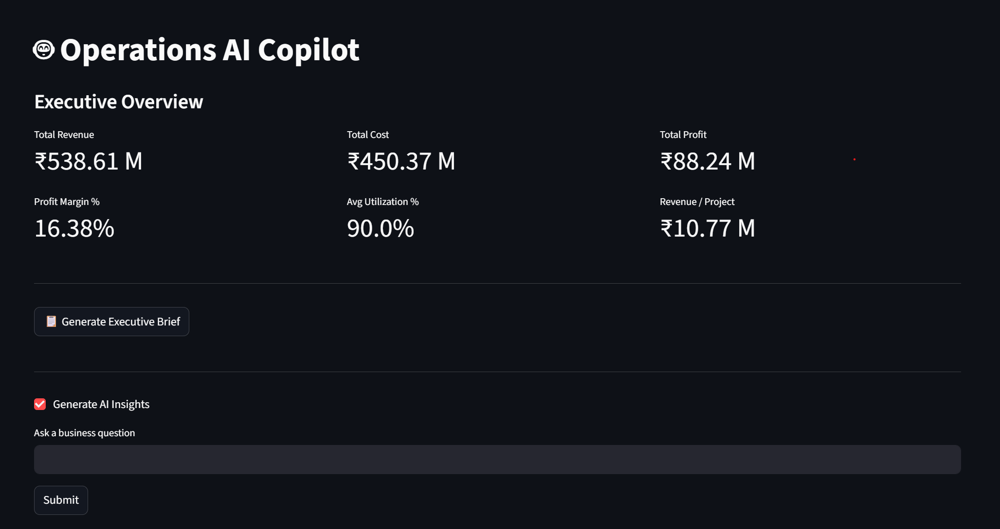

### KPI Dashboard
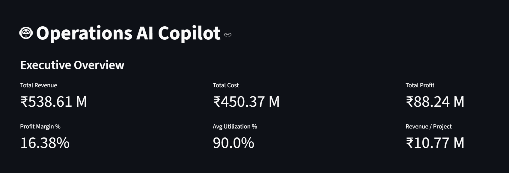

### Executive Brief
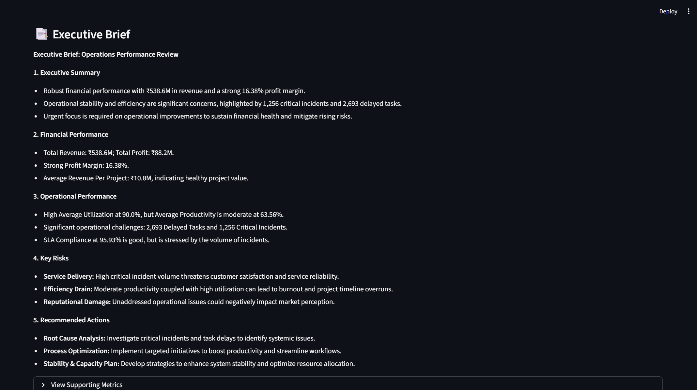

### Project Performance
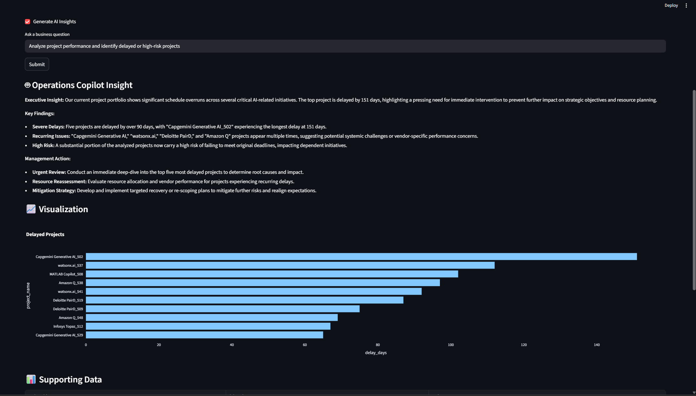

### Business Issues & Risk
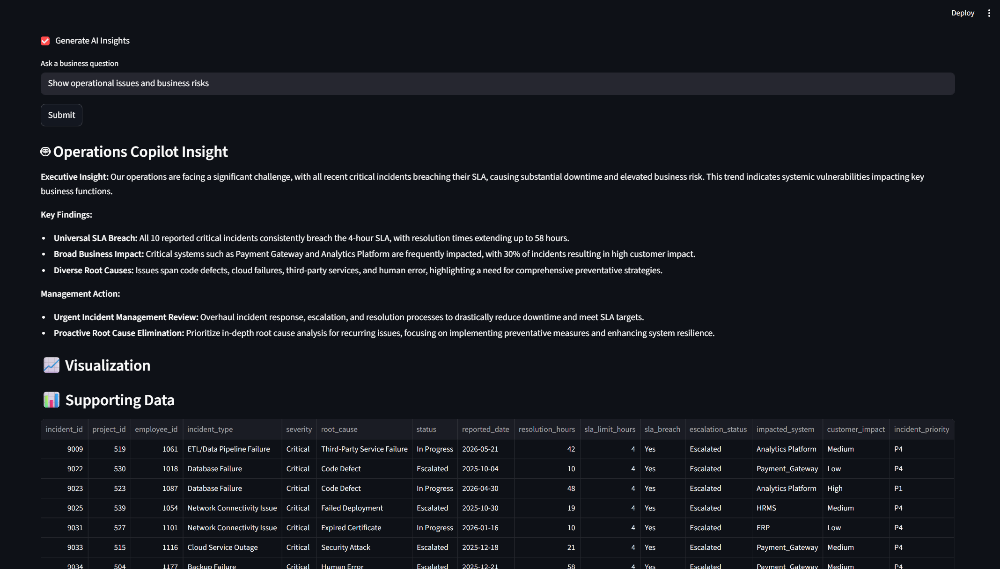

### Employee Utilization
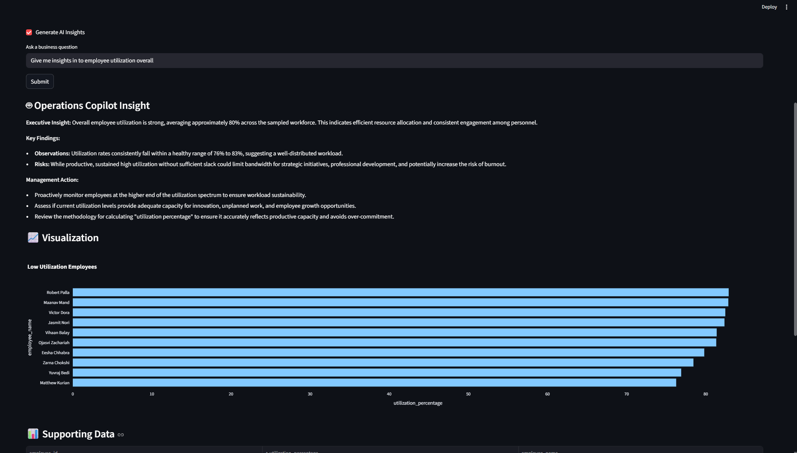

### Root Cause Analysis
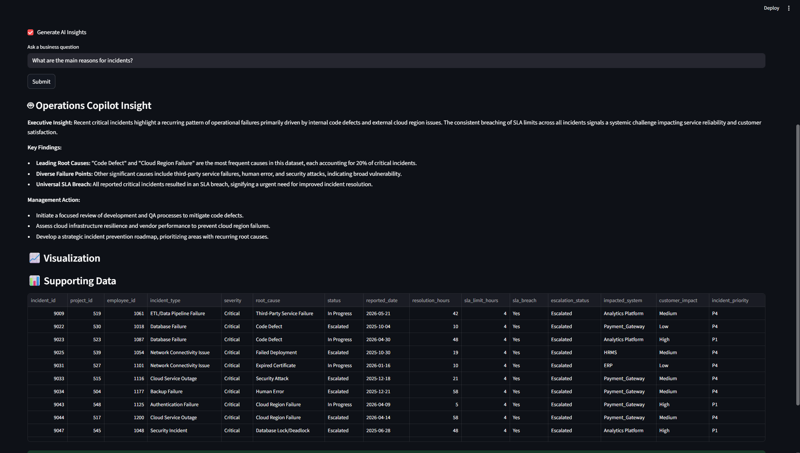

### Generative AI Insights
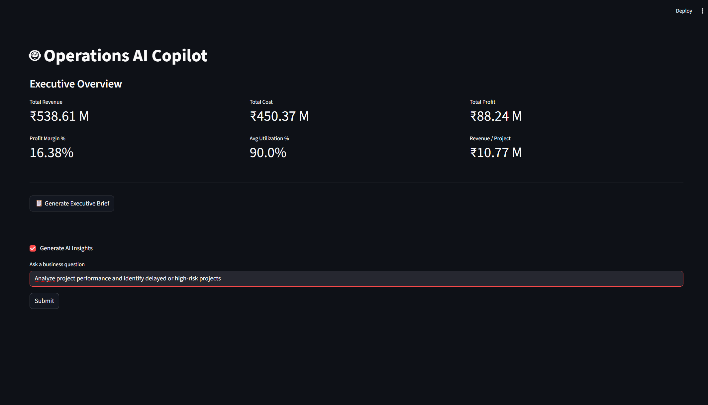

### PowerBi Dashboard
### Executive KPI Dashboard
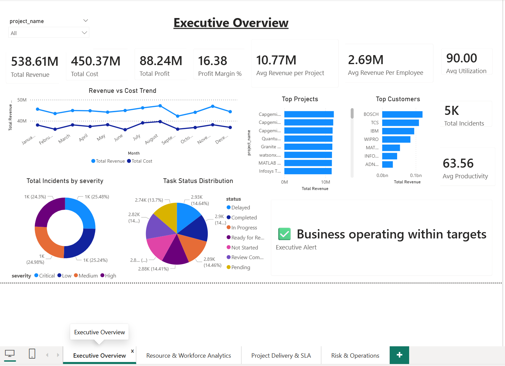

### Project Delivary & SLA
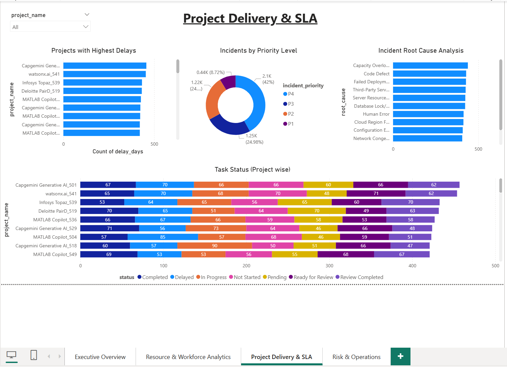

### Risk & Operations
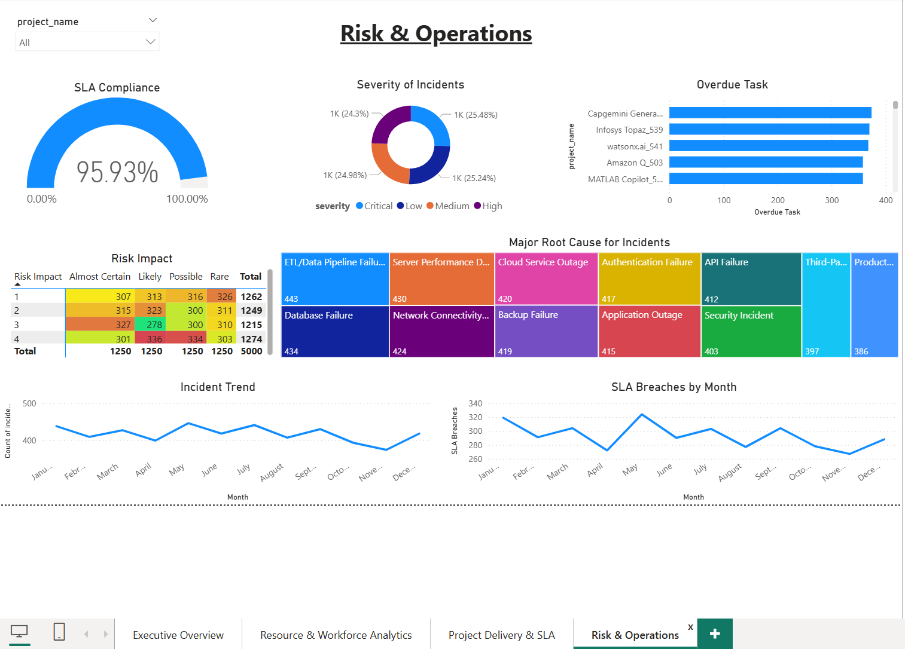

### Resource & Workforce Analytics
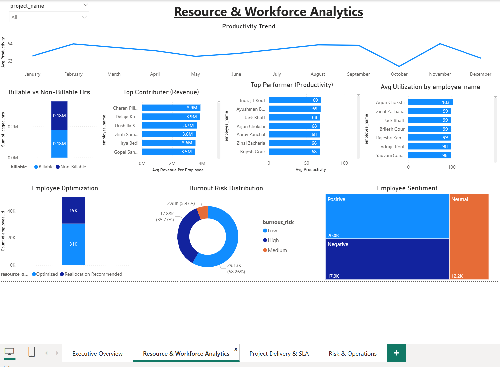

## Future Improvements
* Real-time database integration
* Predictive analytics
* Multi-user authentication
* Agentic workflow automation

## Author
Uday Singh Rathod
